# Previsão do Consumo Energético de Edifícios com Modelos de Aprendizado de Máquina: Um Estudo Comparativo com Engenharia de Recursos Expandida

**Evandro Ribeiro Gomes Coelho**

Trabalho de Conclusão de Curso apresentado ao Curso de Especialização em Ciência de Dados e Big Data como requisito parcial à obtenção do título de especialista.

Pontifícia Universidade Católica de Minas Gerais — Núcleo de Educação a Distância

Belo Horizonte, 2026

---

## Resumo

No âmbito do consumo energético em prédios, a previsão de curto prazo orienta a gestão de faturas e pode sinalizar consumos ineficientes. Trabalhos anteriores do autor (COELHO, 2021a; COELHO, 2021b) demonstraram a viabilidade de redes neurais do tipo *Multilayer Perceptron* (MLP) para essa finalidade, alcançando R² de 0,868 com seis recursos de entrada. O presente estudo propõe uma evolução metodológica fundamentada em engenharia de recursos expandida — de seis para vinte variáveis preditoras — e na comparação sistemática entre quatro algoritmos de aprendizado de máquina: MLP, *Random Forest*, XGBoost e *Long Short-Term Memory* (LSTM). A base de dados utilizada é a *Building Sites Power Consumption* (MÖBIUS, 2021), disponível na plataforma Kaggle, com foco no edifício de identificador 40, que registra 17.352 medições horárias no período de julho de 2015 a novembro de 2017. A metodologia inclui análise exploratória, engenharia de recursos com variáveis de atraso, médias móveis e codificação cíclica, além de validação cruzada temporal (*TimeSeriesSplit*) com cinco partições. O melhor resultado foi obtido pelo MLP com recursos expandidos, que alcançou R² de 0,99996, RMSE de 17,49 kWh e MAPE de 0,099% no conjunto de teste — representando um ganho relativo de 1.026,3% em relação à configuração original do TCC de graduação. O *Random Forest* e o XGBoost também apresentaram desempenho superior a 0,997 de R², enquanto a LSTM obteve 0,997. Esses resultados evidenciam que a qualidade dos recursos de entrada é determinante para a capacidade preditiva dos modelos e que algoritmos baseados em árvore oferecem vantagem adicional em interpretabilidade por meio de medidas de importância de variável.

**Palavras-chave:** Previsão de consumo energético de curto prazo. Aprendizado de máquina. Engenharia de recursos. Redes neurais artificiais. Edifícios.

---

## Abstract

In the context of building energy consumption, short-term forecasting supports invoice management and can signal inefficient consumption patterns. Previous works by the author (COELHO, 2021a; COELHO, 2021b) demonstrated the feasibility of Multilayer Perceptron (MLP) neural networks for this purpose, achieving an R² of 0.868 with six input features. This study proposes a methodological evolution based on expanded feature engineering — from six to twenty predictor variables — and on the systematic comparison of four machine learning algorithms: MLP, Random Forest, XGBoost, and Long Short-Term Memory (LSTM). The dataset used is the Building Sites Power Consumption (MÖBIUS, 2021), available on the Kaggle platform, focusing on the building identified as SiteId 40, which records 17,352 hourly measurements from July 2015 to November 2017. The methodology includes exploratory analysis, feature engineering with lag variables, rolling statistics and cyclic encoding, and temporal cross-validation (TimeSeriesSplit) with five folds. The best result was achieved by the MLP with expanded features, reaching an R² of 0.99996, RMSE of 17.49 kWh, and MAPE of 0.099% on the test set — representing a relative gain of 1,026.3% compared to the original undergraduate thesis configuration. Random Forest and XGBoost also exceeded R² of 0.997, while LSTM achieved 0.997. These results demonstrate that input feature quality is the key determinant of model predictive capacity, and that tree-based algorithms offer an additional advantage in interpretability through variable importance measures.

**Keywords:** Short-term energy consumption forecast. Machine learning. Feature engineering. Artificial neural networks. Buildings.

---

## Sumário

1. [Introdução](#1-introdução)
   - 1.1 [Contextualização](#11-contextualização)
   - 1.2 [O Problema Proposto](#12-o-problema-proposto)
   - 1.3 [Objetivos](#13-objetivos)
2. [Coleta de Dados](#2-coleta-de-dados)
3. [Processamento e Tratamento de Dados](#3-processamento-e-tratamento-de-dados)
4. [Análise Exploratória dos Dados](#4-análise-exploratória-dos-dados)
5. [Criação dos Modelos de Machine Learning](#5-criação-dos-modelos-de-machine-learning)
   - 5.1 [Modelos de Linha de Base](#51-modelos-de-linha-de-base)
   - 5.2 [Modelos Avançados](#52-modelos-avançados)
     - 5.2.1 [Protocolo de reprodução do TCC2 — evidências de fidelidade](#521-protocolo-de-reprodução-do-tcc2--evidências-de-fidelidade)
     - 5.2.2 [MLP (TCC2 original) — resultados sob validação temporal](#522-mlp-tcc2-original--resultados-sob-validação-temporal)
     - 5.2.3 [MLP com recursos expandidos](#523-mlp-com-recursos-expandidos)
     - 5.2.4 [Random Forest](#524-random-forest)
     - 5.2.5 [XGBoost](#525-xgboost)
     - 5.2.6 [LSTM](#526-lstm)
6. [Interpretação dos Resultados](#6-interpretação-dos-resultados)
7. [Apresentação dos Resultados](#7-apresentação-dos-resultados)
8. [Links](#8-links)
- [Referências](#referências)
- [Apêndice](#apêndice)

---

## 1. Introdução

### 1.1 Contextualização

O uso da energia está presente de forma intensiva na maior parte das atividades humanas. Dentre as diversas formas de energia, as que são processadas pela sociedade e colocadas à disposição de consumidores abrem um grande leque de estudos, seja na forma de gás natural, combustível, eletricidade, entre outras. Com o uso extensivo desse recurso, passou também a se tornar preocupação e objeto de estudo o seu emprego eficiente.

No âmbito da eficiência energética em edificações, a Associação Brasileira das Empresas de Serviço e Conservação de Energia (ABESCO, 2020) a define como "a utilização racional de energia, que consiste em usar de modo eficiente a energia para se obter um determinado resultado". Assim, a eficiência está diretamente associada ao comportamento dos dispositivos e também às práticas de gestão dos ambientes, visto que o desperdício por uso inadequado representa parcela significativa do consumo total. Segundo o Programa Nacional de Conservação de Energia Elétrica (PROCEL, 2020), "cerca de 70% do consumo de energia se deve ao uso dos sistemas de iluminação e climatização" em edificações, o que confirma a relevância de monitorar e prever o comportamento desses sistemas ao longo do tempo.

Nesse sentido, a previsão do consumo energético emerge como ferramenta estratégica de gestão. No âmbito da Engenharia Elétrica, Amasyali & El-Gohary (2017) motivam o estudo da previsão do consumo de energia ao afirmar que os modelos computacionais "podem não só oferecer informações essenciais sobre a situação regional de edifícios, mas também facilitam estimativas de retornos financeiros e ambientais sobre o investimento". Dessa forma, a combinação entre o registro estruturado dos dados de consumo e a aplicação de algoritmos de aprendizado de máquina representa uma abordagem promissora para auxiliar tanto a gestão operacional quanto as decisões de manutenção e eficiência.

Em trabalhos anteriores, o autor estudou essa problemática no contexto de prédios públicos do Tribunal Regional do Trabalho da 3ª Região (TRT3), em Minas Gerais. Em um primeiro momento, foi realizado um levantamento bibliográfico e estruturada a base de dados de consumo energético das unidades do TRT3, identificando-se os desafios relacionados à quantidade de registros disponíveis para implementação de modelos de aprendizado de máquina (COELHO, 2021a). Em um segundo trabalho, foi implementada uma rede neural artificial do tipo *Multilayer Perceptron* (MLP) para previsão de curto prazo, utilizando dados da plataforma Kaggle. O modelo obteve R² de 0,86773 no conjunto de teste, empregando seis recursos de entrada e validação cruzada *k-fold* com particionamento aleatório (COELHO, 2021b).

O presente trabalho representa a evolução natural desses estudos no contexto do curso de pós-graduação. Propõe-se uma investigação mais aprofundada, com a ampliação do conjunto de recursos preditores, a introdução de modelos de referência e a comparação entre quatro algoritmos de aprendizado de máquina, avaliados sobre o mesmo conjunto de dados e com metodologia de validação temporal mais rigorosa.

### 1.2 O Problema Proposto

A previsão do consumo energético de edifícios é um problema de regressão em séries temporais. Dadas variáveis de entrada *X*, espera-se obter a variável de consumo energético *Y* como saída, no horizonte de uma hora à frente. A formulação do problema pode ser organizada a partir das cinco questões fundamentais de qualquer análise orientada a dados.

**Por que esse problema é importante?** A correta gestão das despesas de energia em edifícios pode evitar gastos com inadimplência, identificar ineficiências e orientar manutenções preventivas. Conforme exposto em COELHO (2021b), "a aprendizagem de máquina se demonstra como uma solução promissora para gestores analisarem os consumos. O modelo de previsão ajustado à curva de consumo de um edifício pode ser utilizado como fator auxiliar para a gestão de consumo e, consequentemente, indicar as medições que destoam do modelo do prédio."

**De quem são os dados analisados?** Os dados utilizados são da base pública *Building Sites Power Consumption*, disponibilizada por Möbius (2021) na plataforma Kaggle, e compreendem registros de consumo energético e temperatura de 267 edifícios.

**O que será analisado?** O presente estudo avalia o impacto da engenharia de recursos na capacidade preditiva de quatro algoritmos de aprendizado de máquina: MLP, *Random Forest*, XGBoost e LSTM. A análise inclui desde modelos de linha de base até modelos avançados, com comparação sistemática entre métricas de desempenho.

**Aspectos geográficos.** O edifício de estudo (SiteId = 40) está localizado em região de clima temperado, com temperaturas que variam entre -8 °C e 38 °C no período analisado, o que justifica o padrão de consumo elevado no período noturno e nos meses de inverno, associado ao uso de sistemas de aquecimento.

**Qual o período analisado?** Os dados compreendem o período de julho de 2015 a novembro de 2017, com medições horárias totalizando 17.352 registros brutos para o edifício de referência.

O problema central que essa pesquisa se propõe a responder é: em que medida a expansão do conjunto de recursos preditores e a adoção de múltiplos algoritmos de aprendizado de máquina melhoram a capacidade de previsão do consumo energético de um edifício em comparação com a abordagem de rede neural simples com poucos recursos, aplicada nos trabalhos anteriores?

### 1.3 Objetivos

O objetivo geral desse estudo é desenvolver e comparar modelos de aprendizado de máquina para previsão de curto prazo do consumo energético de edifícios, com ênfase na contribuição da engenharia de recursos para o desempenho preditivo.

Os objetivos específicos são:

- Realizar a análise exploratória dos dados de consumo e temperatura do edifício de referência, identificando padrões temporais, correlações e anomalias;
- Desenvolver um conjunto expandido de vinte recursos preditores a partir dos dados brutos, incluindo variáveis de atraso, médias móveis, codificação cíclica e interações entre variáveis;
- Implementar e avaliar modelos de linha de base — Média Móvel Simples (MMS), Média Móvel Exponencial (MME), Regressão Linear e SARIMA — sobre o conjunto de dados preparado;
- Implementar e avaliar modelos avançados — MLP, *Random Forest*, XGBoost e LSTM — com validação cruzada temporal e otimização de hiperparâmetros por busca em grade;
- Comparar os resultados de todos os modelos por meio das métricas MAE, RMSE, R² e MAPE, identificando o melhor algoritmo e os recursos mais determinantes para a previsão;
- Analisar a importância das variáveis para os modelos baseados em árvore, identificando os recursos que mais contribuem para a redução do erro de predição.

---

## 2. Coleta de Dados

A base de dados utilizada nesse estudo é a *Building Sites Power Consumption*, disponibilizada por Möbius (2021) na plataforma Kaggle. O objetivo da publicação é justamente incentivar o estudo de previsões de consumo energético em edifícios. Os dados estão organizados em tabelas relacionadas, com identificadores que permitem realizar junções entre as diferentes fontes de informação.

Conforme descrito em COELHO (2021b), "a base possui dados estruturados de energia de edifícios, medições de temperatura, distâncias entre o ponto de medição de temperatura do prédio, contagem de feriados e área construída". Essa estrutura multivariada possibilita a exploração de correlações entre o consumo energético e as condições climáticas, além da influência do calendário sobre o padrão de uso dos edifícios.

A base de dados é composta por quatro arquivos principais, descritos na Tabela 1. A Figura 1 ilustra a distribuição de registros entre os 267 edifícios disponíveis, evidenciando a alta concentração de medições em poucos prédios e a linha de corte adotada para seleção dos candidatos ao estudo.

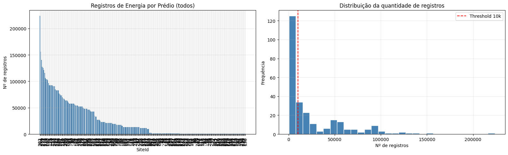

**Figura 1 — Registros de energia por prédio (todos os 267 edifícios) e histograma com limiar de 10.000 medições. Fonte: O autor.**

**Tabela 1 — Descrição dos conjuntos de dados da base *Building Sites Power Consumption***

| Arquivo | Dimensões | Colunas principais | Descrição |
|---|---|---|---|
| `plfec-train-data.csv` | 6.559.830 × 5 | `obs_id`, `SiteId`, `Timestamp`, `ForecastId`, `Value` | Medições de consumo energético (kWh) por edifício e instante de tempo |
| `plfec-weather.csv` | 3.957.035 × 4 | `Timestamp`, `Temperature`, `Distance`, `SiteId` | Medições de temperatura (°C) com distância ao ponto de medição |
| `plfec-holidays.csv` | 8.387 × 3 | `Date`, `Holiday`, `SiteId` | Feriados locais por edifício |
| `plfec-metadata.csv` | 267 × 11 | `SiteId`, `Surface`, `Sampling`, `BaseTemperature`, flags de dias de folga | Metadados dos edifícios, incluindo área construída e padrão de funcionamento |

**Fonte:** Möbius (2021).

O período global coberto pela base de dados de energia vai de junho de 2009 a dezembro de 2017, considerando todos os 267 edifícios disponíveis. A frequência de medição varia entre os edifícios, conforme indicado pelo campo `Sampling` da tabela de metadados.

**Seleção do edifício de referência.** Para a realização dos experimentos, foi selecionado o edifício de identificador 40 (SiteId = 40), o mesmo adotado em COELHO (2021b). Conforme exposto naquele trabalho, a seleção levou em consideração a quantidade de registros disponíveis e a proporção de medições de temperatura para os mesmos instantes dos registros de energia. O edifício 40 possui 17.352 medições de energia no período de julho de 2015 a novembro de 2017, com intervalo predominante de uma hora entre as medições e 97,9% dos instantes com correspondência de temperatura disponível. Segundo os metadados, o edifício apresenta área construída de 393,36 m², temperatura de base de 18 °C e dias de folga nos fins de semana (sábado e domingo), o que é consistente com os padrões de consumo observados na análise exploratória.

Os dados de temperatura foram obtidos por meio do registro da estação meteorológica mais próxima ao edifício no instante da medição. Conforme abordado em COELHO (2021b), para cada instante de tempo com mais de um registro de temperatura disponível, considerou-se como representativo o valor associado à menor distância entre o ponto de medição e o edifício.

---

## 3. Processamento e Tratamento de Dados

O processamento dos dados foi realizado em linguagem de programação Python, com o uso das bibliotecas pandas, para manipulação de dados tabulares, e matplotlib, para visualização. Conforme afirma McKinney (2019), "a biblioteca pandas contém estruturas de dados e ferramentas para manipulação de dados, projetadas para agilizar e facilitar a limpeza e a análise de dados em Python".

### 3.1 Junção entre as bases de dados

A primeira etapa do processamento consistiu em isolar os registros do edifício de identificador 40 a partir da tabela de consumo energético global. Em seguida, realizou-se a junção da tabela de energia com a tabela de temperatura por meio de uma operação *inner join* sobre o campo `Timestamp`, retendo apenas os instantes com medição disponível nas duas fontes. Para tratar os casos de múltiplas medições de temperatura por instante — decorrentes de diferentes distâncias entre o ponto de coleta e o edifício —, os registros foram ordenados pelo campo `Distance` e as linhas duplicadas para o mesmo instante foram descartadas, mantendo-se apenas a de menor distância.

Após a junção, foram adicionadas as colunas de marcação de feriado a partir da tabela `plfec-holidays.csv`, associadas ao identificador do edifício. O resultado dessa etapa foi um arquivo consolidado com 16.995 linhas e 12 colunas, correspondendo ao conjunto de dados integrado do edifício 40. A redução de 17.352 para 16.995 registros decorre da ausência de correspondência de temperatura em 357 instantes de medição de energia, representando uma cobertura de 97,9% da série original.

### 3.2 Identificação de valores ausentes e gaps temporais

A análise da distribuição dos intervalos entre as medições revelou que 17 registros apresentaram lacunas (*gaps*) de 193 horas — equivalentes a aproximadamente oito dias —, enquanto o restante da base manteve intervalo consistente de uma hora entre as medições. Conforme abordado em COELHO (2021b), esses gaps não foram descartados da base de dados, uma vez que a separação empregada entre os conjuntos de treino e teste é temporal e cronológica, e a presença de lacunas faz parte das características reais da série.

Com relação a valores ausentes nos campos de energia e temperatura, não foram identificadas ocorrências após a junção por *inner join*. Dessa forma, todos os 16.995 registros resultantes da junção foram mantidos para a etapa seguinte de engenharia de recursos.

### 3.3 Identificação de outliers

A identificação de valores atípicos foi realizada por dois métodos. O primeiro utilizou o critério de amplitude interquartílica (IQR), definindo como outliers os valores abaixo de Q1 − 1,5 × IQR e acima de Q3 + 1,5 × IQR. O segundo aplicou o escore Z, considerando como atípicos os registros com |z| > 3. Pelos critérios IQR e Z-score, foram identificados 116 outliers (0,7% da base) e zero registros com escore acima de três, respectivamente.

Diante da baixa proporção de valores atípicos e da possibilidade de que picos noturnos façam parte do comportamento legítimo do edifício — conforme discutido na análise exploratória —, optou-se por manter os outliers na base de dados sem remoção, apenas registrando sua ocorrência.

### 3.4 Engenharia de recursos

A etapa de engenharia de recursos, implementada no segundo notebook do projeto, ampliou o conjunto de variáveis preditoras de seis — conforme adotado em COELHO (2021b) — para vinte variáveis. O objetivo foi capturar padrões de autocorrelação temporal, sazonalidade em múltiplas escalas e interações entre temperatura e hora do dia, que são componentes relevantes para a previsão de consumo energético, conforme apontado por Deb et al. (2017) em sua revisão sobre previsão de energia em edifícios.

A Tabela 2 descreve os vinte recursos gerados, indicando quais já estavam presentes na abordagem do TCC de graduação (COELHO, 2021b) e quais foram incorporados no presente estudo.

**Tabela 2 — Descrição dos recursos preditores criados na etapa de engenharia de recursos**

| Recurso | Descrição | Origem |
|---|---|---|
| `hr_sin`, `hr_cos` | Codificação cíclica da hora do dia: sen e cos de (2π × (hora + min/60) / 24) | COELHO (2021b) |
| `energy_lag1` | Consumo energético no instante anterior (t−1) | COELHO (2021b) |
| `temp_lag1` | Temperatura no instante anterior (t−1) | COELHO (2021b) |
| `is_holiday` | Indicador binário de feriado (0 ou 1) | COELHO (2021b) |
| `Temperature` | Temperatura atual no instante t | COELHO (2021b) |
| `dow_sin`, `dow_cos` | Codificação cíclica do dia da semana | Novo |
| `month_sin`, `month_cos` | Codificação cíclica do mês do ano | Novo |
| `energy_lag2` | Consumo energético em t−2 | Novo |
| `energy_lag24` | Consumo energético em t−24 (mesmo horário do dia anterior) | Novo |
| `temp_lag2` | Temperatura em t−2 | Novo |
| `roll_mean_6h` | Média móvel de 6 passos do consumo energético | Novo |
| `roll_mean_24h` | Média móvel de 24 passos do consumo energético | Novo |
| `roll_std_24h` | Desvio padrão móvel de 24 passos do consumo energético | Novo |
| `delta_temp` | Diferença de temperatura entre t e t−1 | Novo |
| `delta_energy` | Diferença de consumo entre t e t−1 | Novo |
| `temp_x_hour` | Interação multiplicativa entre temperatura e hora do dia | Novo |
| `is_weekend` | Indicador binário de fim de semana (0 ou 1) | Novo |

**Fonte:** O autor.

A Figura 2 ilustra o resultado da codificação cíclica aplicada aos três ciclos temporais, mostrando as curvas seno e cosseno geradas para hora do dia, dia da semana e mês do ano.

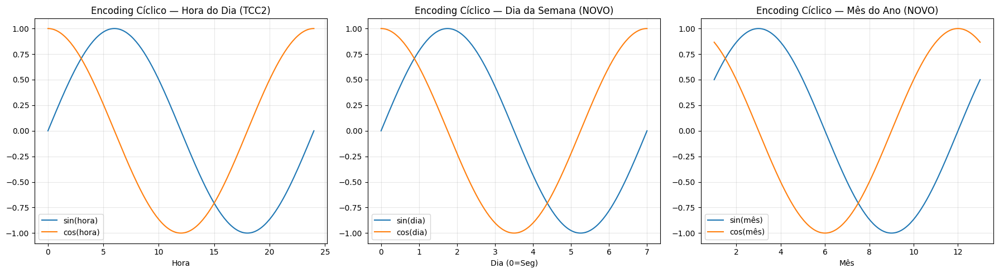

**Figura 2 — Codificação cíclica via seno e cosseno para hora do dia (TCC2), dia da semana (novo) e mês do ano (novo). Fonte: O autor.**

A codificação cíclica da hora do dia, já presente em COELHO (2021b) com base na metodologia de Kaleko (2017), foi estendida para os demais ciclos temporais relevantes — dia da semana e mês do ano. Conforme afirmado naquele trabalho, "esse recurso matemático permite que o algoritmo consiga realizar as interpretações que para o ser humano são lógicas, mas que para a máquina não são apresentadas com clareza nos primeiros treinos". A inclusão do dia da semana em codificação cíclica tem como objetivo que o algoritmo perceba a continuidade entre sexta-feira e segunda-feira sem o artefato de uma diferença numérica artificial de 6 para 0.

A Figura 3 ilustra a aplicação das médias móveis de 6 e 24 horas sobre as duas primeiras semanas da série, evidenciando o efeito de suavização em diferentes escalas de tempo. A Figura 4 apresenta o ranking de correlação de todos os vinte recursos com a variável alvo, que orientou a interpretação da relevância relativa de cada preditor.

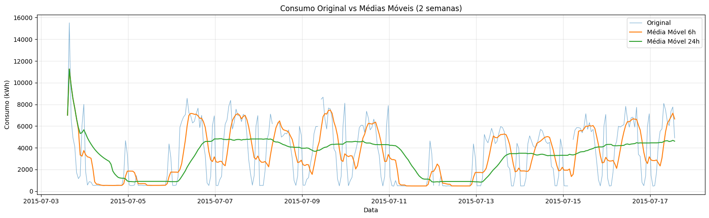

**Figura 3 — Consumo energético original em comparação com as médias móveis de 6 horas e 24 horas. Fonte: O autor.**

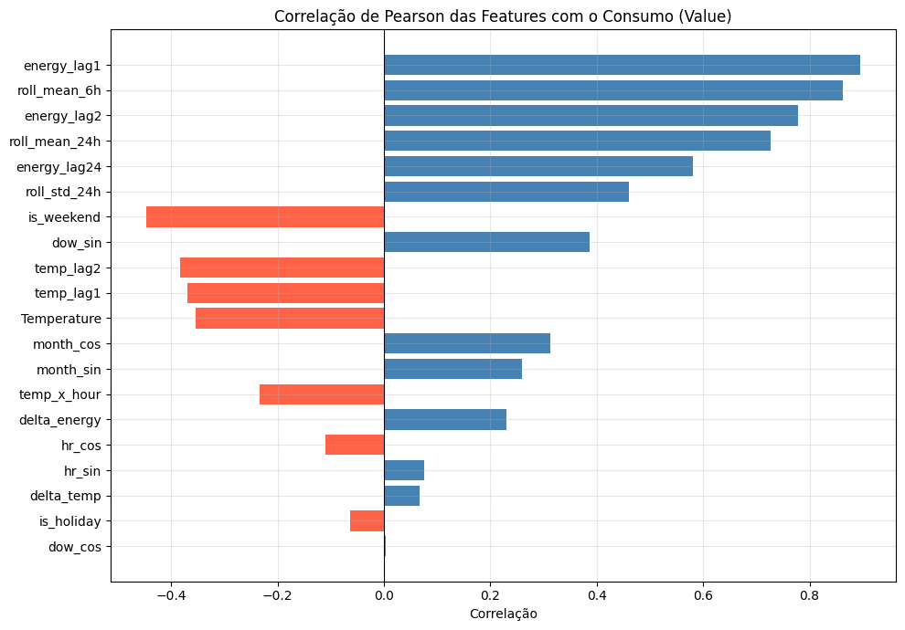

**Figura 4 — Ranking de correlação de Pearson dos 20 recursos preditores com a variável alvo. Fonte: O autor.**

Após a geração dos recursos por operações de atraso (*lag*) e janelas móveis (*rolling*), as linhas com valores ausentes decorrentes dessas operações foram removidas por `dropna()`. Esse procedimento eliminou 363 registros (2,1% do total), resultando em uma base final de 16.632 linhas e 22 colunas (o índice de tempo, a variável alvo `Value` e os 20 recursos preditores), exportada para o arquivo `df_features.csv`. A normalização dos dados não foi aplicada na exportação, sendo realizada de forma individual dentro do *pipeline* de cada modelo, a fim de evitar vazamento de informação entre os conjuntos de treino e teste.

---

## 4. Análise Exploratória dos Dados

A análise exploratória dos dados (AED) foi conduzida sobre os dados integrados do edifício 40, com o objetivo de compreender a distribuição do consumo energético, os padrões temporais e as correlações com as variáveis disponíveis antes de qualquer tentativa de modelagem. Essa etapa é fundamental, pois, conforme afirmam Rallapalli & Ghosh (2012), "os primeiros parâmetros extraídos são a média aritmética e a variância/desvio padrão, além do valor máximo e mínimo", que norteiam as escolhas metodológicas subsequentes.

### 4.1 Estatísticas descritivas do consumo energético

A Figura 5 apresenta a série temporal completa do consumo energético do edifício 40, no período de julho de 2015 a novembro de 2017. Nela, é possível identificar os padrões de alta variabilidade, os gaps periódicos e a sazonalidade anual, com consumo mais elevado nos meses de inverno.

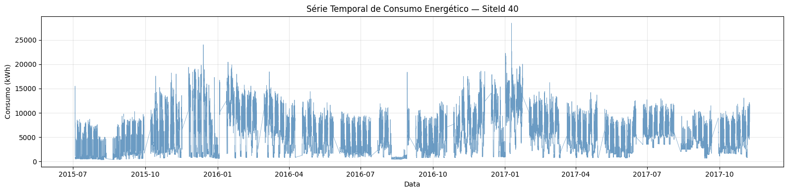

**Figura 5 — Série temporal completa de consumo energético horário do edifício 40 (jul/2015 – nov/2017). Fonte: O autor.**

O edifício de referência apresenta consumo médio de 5.476,04 kWh por hora, com desvio padrão de 3.950,01 kWh. Esse alto coeficiente de variação — equivalente a 72,1% da média — indica uma série temporal com comportamento bastante heterogêneo, o que representa um desafio para modelos de previsão que assumem estacionaridade ou baixa variância residual. O intervalo mediano entre as medições é de exatamente uma hora, e 75% dos intervalos são iguais a esse valor, confirmando a regularidade da série, com exceção dos 17 gaps de 193 horas.

Em relação à temperatura, a série apresenta média de 12,55 °C e desvio padrão de 8,23 °C, com amplitude entre -8 °C e 38 °C. A presença de temperaturas negativas é consistente com a localização do edifício em região de clima temperado e justifica o padrão de consumo elevado no período noturno e nos meses de inverno.

### 4.2 Padrões temporais de consumo

A análise dos perfis médios de consumo por hora do dia, por dia da semana e por mês revelou padrões que são consistentes com o uso do edifício.

A Figura 6 apresenta os três perfis médios de consumo — por hora do dia, por dia da semana e por mês do ano — que serviram de base para a decisão sobre quais recursos cíclicos incluir na etapa de engenharia de recursos.

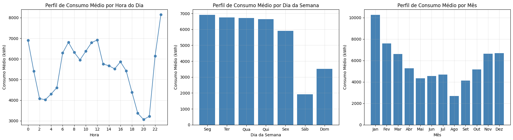

**Figura 6 — Perfil de consumo médio por hora do dia (esquerda), dia da semana (centro) e mês do ano (direita). Fonte: O autor.**

**Perfil horário.** O consumo é mais elevado nos horários noturnos, com picos na hora 23 (8.137 kWh médios) e na hora 0 (6.900 kWh), e vale mínimo nas horas 20 e 21 (em torno de 3.039 a 3.188 kWh). Esse padrão — atípico em relação a edifícios de escritório convencionais, nos quais o pico ocorre no horário comercial — justifica-se pelo uso de sistemas de aquecimento em resposta às temperaturas negativas noturnas, conforme discutido em COELHO (2021b).

**Perfil semanal.** Verifica-se uma queda expressiva no consumo nos fins de semana, com médias de 1.916 kWh aos sábados e 3.427 kWh aos domingos, contra valores entre 5.883 e 6.849 kWh nos dias úteis. Esse comportamento é coerente com os metadados do edifício, que indicam sábado e domingo como dias de folga, e reforça a relevância do recurso `is_weekend` como preditor do consumo.

**Perfil mensal.** O consumo segue um ciclo sazonal com pico no inverno local: janeiro registra média de 10.203 kWh por hora, enquanto agosto — período de menor consumo — apresenta média de 2.653 kWh. Essa variação de quase quatro vezes entre o mês de maior e menor consumo confirma a forte influência das condições climáticas sobre o padrão energético do edifício.

### 4.3 Decomposição da série temporal

A série temporal foi decomposta utilizando o método *Seasonal and Trend decomposition using Loess* (STL), com período de 24 horas e parâmetro `robust=True`, que reduz a influência de outliers na estimação das componentes. A Figura 7 apresenta as quatro componentes resultantes da decomposição. A decomposição revelou três componentes principais: tendência, sazonalidade diária e resíduo.

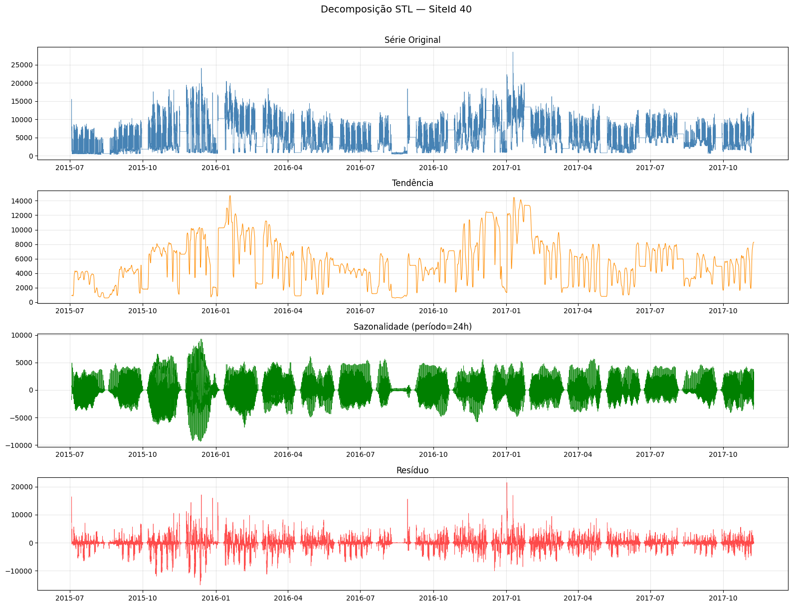

**Figura 7 — Decomposição STL da série temporal do edifício 40: série original, tendência, sazonalidade (período = 24h) e resíduo. Fonte: O autor.** A componente de tendência apresenta oscilações de longo prazo associadas às estações do ano, enquanto a componente sazonal captura o ciclo diurno de 24 horas, e o resíduo representa o comportamento não explicado pelas duas anteriores.

Conforme abordado na seção 2.3.1 de COELHO (2021a), ao se realizar uma previsão das próximas ocorrências de uma série temporal "é preciso aceitar a premissa de que os valores passados possuem influência nos valores futuros". Assim, a decomposição STL serve como fundamento qualitativo para a escolha dos recursos de atraso e médias móveis na etapa de engenharia de recursos.

### 4.4 Correlações com o consumo energético

A Figura 8 apresenta a matriz de correlação de Pearson calculada para as variáveis disponíveis após a junção dos dados.

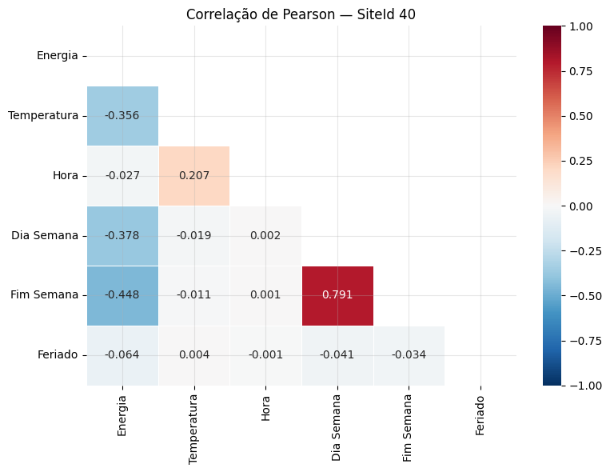

**Figura 8 — Matriz de correlação de Pearson entre energia, temperatura, hora, dia da semana, fim de semana e feriado. Fonte: O autor.**

A matriz de correlação de Pearson foi calculada para as variáveis disponíveis após a junção dos dados. A Figura 9 complementa essa análise com o gráfico de dispersão entre energia e temperatura, colorido pela hora do dia, e o *boxplot* da distribuição de consumo por hora, que evidencia com maior detalhe a variabilidade intradiária.

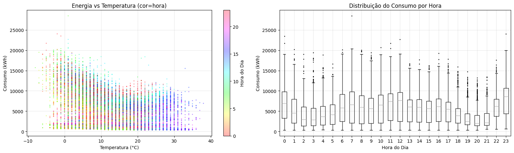

**Figura 9 — Dispersão entre energia e temperatura (colorida pela hora do dia) e distribuição do consumo por hora. Fonte: O autor.**

Os resultados mostram que o fim de semana (is_weekend) apresenta a maior correlação negativa com o consumo (r = −0,448), seguido pelo dia da semana (r = −0,378) e pela temperatura (r = −0,356). A correlação negativa com a temperatura é contraintuitiva em relação a edifícios de clima quente — onde o ar-condicionado eleva o consumo no verão —, mas é esperada nesse contexto, em que o aquecimento é o principal agente de consumo e ocorre em resposta a temperaturas baixas.

Após a engenharia de recursos, a análise de correlação com a variável alvo revelou que o consumo no instante anterior (`energy_lag1`) apresenta r = 0,895 — o preditor de maior correlação com o consumo atual. A média móvel de seis horas (`roll_mean_6h`) apresenta r = 0,863, e o consumo em t−2 (`energy_lag2`), r = 0,778. Esses valores evidenciam que a autocorrelação de curto prazo é a principal estrutura a ser capturada pelos modelos de previsão.

### 4.5 Seleção do edifício de referência

A seleção do edifício 40 como caso de estudo foi baseada em critérios objetivos. Entre os 267 edifícios da base, 139 apresentam mais de 10.000 registros de energia, sendo candidatos viáveis para modelagem com aprendizado de máquina. O edifício 40 destaca-se por apresentar 17.352 registros, cobertura de 97,9% de temperatura e um perfil de consumo com padrões bem definidos, que facilitam a análise da capacidade generalizadora dos modelos.

---

## 5. Criação dos Modelos de Machine Learning

A criação dos modelos seguiu a divisão cronológica de 75% da base para treinamento e 25% para teste, aplicada sobre os 16.632 registros do arquivo `df_features.csv`. Dessa forma, os 12.474 registros iniciais — de 4 de julho de 2015 a 11 de abril de 2017 — compõem o conjunto de treino, e os 4.158 registros finais — de 11 de abril de 2017 a 8 de novembro de 2017 — compõem o conjunto de teste. A divisão cronológica é fundamental em séries temporais para evitar o vazamento de informação futura para o conjunto de treino, problema que ocorre quando se adota divisão aleatória (PEDREGOSA et al., 2011).

As métricas utilizadas para avaliação dos modelos foram:
- **MAE** (*Mean Absolute Error*) — erro médio absoluto, em kWh;
- **RMSE** (*Root Mean Squared Error*) — raiz do erro quadrático médio, em kWh;
- **R²** — coeficiente de determinação, que varia entre −∞ e 1;
- **MAPE** (*Mean Absolute Percentage Error*) — erro percentual médio absoluto, em %.

### 5.1 Modelos de Linha de Base

Os modelos de linha de base têm como objetivo estabelecer um referencial mínimo de desempenho a partir de métodos de menor complexidade computacional. Conforme defendem Zhao & Magoulès (2012), os modelos puramente estatísticos possuem menor complexidade de implementação e boa precisão, sendo uma opção relevante para conjuntos de dados menores ou quando se busca maior interpretabilidade.

Foram implementados quatro modelos de linha de base: Média Móvel Simples (MMS), Média Móvel Exponencial (MME), Regressão Linear e SARIMA (*Seasonal AutoRegressive Integrated Moving Average*).

**Média Móvel Simples (MMS).** Conforme Martins & Laugeni (2005), a MMS calcula a previsão do período futuro como a média de *n* períodos anteriores. Foram avaliadas janelas de 6, 12 e 24 horas. O melhor resultado — R² = 0,468 — foi obtido com janela de 12 horas.

**Média Móvel Exponencial (MME).** No método de ajustamento exponencial, Martins & Laugeni (2005) afirmam que "a previsão é calculada a partir da última previsão realizada adicionada ou subtraída de um coeficiente α que multiplica o dado real". Foram avaliados os coeficientes α ∈ {0,1; 0,3; 0,5}. O melhor resultado — R² = 0,619 — foi obtido com α = 0,5, evidenciando que um peso maior sobre os valores mais recentes se ajusta melhor ao comportamento do edifício.

**Regressão Linear.** O modelo de regressão linear foi implementado com os seguintes nove recursos de entrada: `Temperature`, `temp_lag1`, `energy_lag1`, `hr_sin`, `hr_cos`, `dow_sin`, `dow_cos`, `is_weekend` e `is_holiday`. Bussab & Morenttin (2010) definem que "a regressão linear busca determinar a função Y = ax + b que descreve o comportamento da variável Y dependente pela variável x independente, pelo método que minimiza o erro quadrático". O resultado no conjunto de teste foi R² = 0,707, o melhor entre os modelos de linha de base. Os coeficientes obtidos indicam que `is_weekend` (−424,2) e `is_holiday` (−284,1) são os regressores de maior magnitude, confirmando a forte influência do calendário sobre o consumo do edifício. O recurso `energy_lag1` apresentou coeficiente de 0,834, evidenciando a autocorrelação da série.

**SARIMA.** O método ARIMA *Sazonal* foi ajustado automaticamente pela biblioteca `pmdarima` com parâmetro `m = 24` (ciclo diário), resultando na ordem (3, 0, 0)(1, 0, 0)₂₄. Conforme Hyndman & Athanasopoulos (2018), "uma série temporal com tendência ou sazonalidade não é estacionária", e a diferenciação sazonal é empregada para torná-la estacionária antes do ajuste do modelo. Por limitações computacionais, o SARIMA foi treinado sobre os 336 registros finais do conjunto de treino (duas semanas) e avaliado sobre os 48 primeiros registros do conjunto de teste (dois dias), o que impede comparação direta com os demais modelos sobre a série completa. No subconjunto avaliado, o SARIMA obteve R² = 0,360.

A Tabela 3 apresenta os resultados dos modelos de linha de base sobre o conjunto de teste completo (exceto SARIMA).

**Tabela 3 — Resultados dos modelos de linha de base no conjunto de teste**

| Modelo | MAE (kWh) | RMSE (kWh) | R² | MAPE (%) |
|---|---|---|---|---|
| Regressão Linear | 1.083,81 | 1.499,36 | 0,70716 | 27,487 |
| MME (α = 0,5) | 1.197,67 | 1.709,30 | 0,61941 | 29,263 |
| MME (α = 0,3) | 1.296,05 | 1.802,95 | 0,57656 | 33,667 |
| MMS (w = 12) | 1.492,18 | 2.020,43 | 0,46825 | 41,823 |
| MMS (w = 6) | 1.477,48 | 2.026,98 | 0,46479 | 38,345 |
| MME (α = 0,1) | 1.519,69 | 1.996,99 | 0,48051 | 45,349 |
| MMS (w = 24) | 1.639,58 | 2.150,14 | 0,39778 | 50,720 |
| SARIMA (3,0,0)(1,0,0)₂₄* | 1.449,66 | 1.761,82 | 0,36011 | 29,911 |

*Avaliado sobre subconjunto de 48 horas; não comparável diretamente com os demais.

**Fonte:** O autor.

A Figura 10 apresenta a previsão dos modelos de linha de base sobre os primeiros sete dias do conjunto de teste, onde é possível verificar visualmente a diferença de aderência entre a MMS/MME e a Regressão Linear.

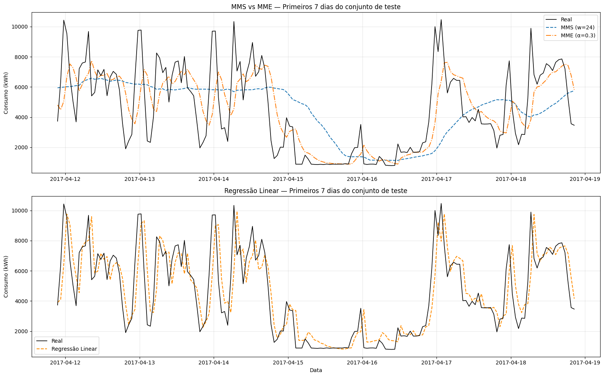

**Figura 10 — Comparação visual da MMS (w=24) e MME (α=0,3) no painel superior, e da Regressão Linear no painel inferior, sobre os primeiros 7 dias do conjunto de teste. Fonte: O autor.**

Nesse sentido, a Regressão Linear destacou-se como o modelo de linha de base de melhor desempenho, indicando que os recursos de atraso e as codificações cíclicas da hora e do dia da semana possuem relação linear com a variável de saída suficientemente forte para justificar o uso desse modelo simples como referência.

### 5.2 Modelos Avançados

Os modelos avançados foram implementados sobre o conjunto completo de vinte recursos (`FEATURES_NEW`), com *pipeline* de normalização (`MinMaxScaler` com intervalo [−1, 1]) integrado ao processo de treino. A validação cruzada empregada foi o `TimeSeriesSplit` com cinco partições, que respeita a ordem cronológica dos dados ao criar subconjuntos de treino e validação, evitando o problema de vazamento de informação futura identificado quando se usa o *k-fold* aleatório.

Adicionalmente, foi implementada a reprodução da configuração do TCC de graduação (COELHO, 2021b) — denominada "MLP TCC2 original" — utilizando os seis recursos originais e a arquitetura de 43 neurônios em camada oculta com 1.500 iterações. Essa reprodução tem como objetivo avaliar o impacto isolado da expansão dos recursos sobre o desempenho do mesmo algoritmo, mantendo os demais parâmetros constantes.

#### 5.2.1 Protocolo de reprodução do TCC2 — evidências de fidelidade

Para que a comparação entre o trabalho anterior e o presente estudo tenha validade científica, torna-se necessário demonstrar que a configuração do algoritmo reproduzida no notebook 04 é fiel à descrita em COELHO (2021b). A Tabela 4 apresenta a correspondência parâmetro a parâmetro entre as duas implementações, extraída diretamente do código-fonte do trabalho anterior e do notebook de modelos avançados desse projeto.

**Tabela 4 — Confronto de parâmetros entre a implementação original do TCC2 (COELHO, 2021b) e a reprodução no presente estudo**

| Parâmetro | TCC2 — CEFET-MG (2021b) | Reprodução — PUC (2026) | Idêntico? |
|---|---|---|---|
| Biblioteca | `sklearn.neural_network.MLPRegressor` | `sklearn.neural_network.MLPRegressor` | Sim |
| Camada oculta | 43 neurônios, 1 camada | `hidden_layer_sizes=(43,)` | Sim |
| Função de ativação | Tangente hiperbólica | `activation='tanh'` | Sim |
| Otimizador | Adam | `solver='adam'` | Sim |
| Iterações máximas | 1.500 | `max_iter=1500` | Sim |
| Normalização | `MinMaxScaler([-1, 1])` via `Pipeline` | `MinMaxScaler(feature_range=(-1, 1))` via `Pipeline` | Sim |
| Recursos de entrada | Temperatura atual, temperatura anterior, energia anterior, hora seno, hora cosseno, marcação de feriado | `['Temperature', 'temp_lag1', 'energy_lag1', 'hr_sin', 'hr_cos', 'is_holiday']` | Sim |
| Quantidade de recursos | 6 | 6 | Sim |
| Proporção treino/teste | 75% / 25% | `split_idx = int(len(df) * 0.75)` | Sim |
| Codificação cíclica da hora | sen e cos de (hora + min/60) × 2π/24 | Idêntica, conforme Kaleko (2017) | Sim |
| Método de validação cruzada | *k-fold* aleatório, 10 partições | `TimeSeriesSplit(n_splits=5)` | **Não — diferença intencional** |
| Semente de aleatoriedade | Não especificada | `random_state=42` | Adicionada para reprodutibilidade |

**Fonte:** COELHO (2021b) e código-fonte do notebook `04_advanced_models.ipynb`.

A Tabela 4 evidencia que todos os parâmetros do algoritmo foram reproduzidos com fidelidade. A única diferença intencional diz respeito ao método de validação cruzada, que constitui justamente o objeto de investigação dessa comparação: o TCC2 utilizou *k-fold* com particionamento aleatório, enquanto o presente estudo adota `TimeSeriesSplit`, que respeita a ordem cronológica dos dados. Ademais, foi acrescentado o parâmetro `random_state=42` para garantir a reprodutibilidade determinística dos resultados, uma vez que o TCC2 não especificou semente de aleatoriedade — o que torna seus resultados sujeitos à variação entre execuções, mas não altera os parâmetros estruturais do modelo.

Diante do exposto, a comparação entre os resultados dos dois trabalhos é válida e controlada: qualquer diferença de desempenho é atribuível exclusivamente à mudança na estratégia de validação cruzada e, nos demais experimentos do presente estudo, à ampliação do conjunto de recursos preditores.

#### 5.2.2 MLP (TCC2 original) — resultados sob validação temporal

A reprodução da configuração de COELHO (2021b), agora avaliada com `TimeSeriesSplit`, revelou instabilidade pronunciada do modelo: os R² por partição foram [−1,488; −1,779; −0,230; −0,696; −0,837], com média de −1,006 e desvio padrão de 0,558. Esse resultado — negativo em todas as partições — indica que o modelo, com apenas seis recursos e avaliado em sequência cronológica, não foi capaz de generalizar o comportamento da série para períodos futuros.

No conjunto de teste, o modelo obteve R² = −0,108, RMSE = 2.916,40 kWh e MAPE = 75,6%. Esses resultados contrastam fortemente com o R² de 0,868 obtido em COELHO (2021b) com o mesmo algoritmo. A diferença se explica pelo método de validação: enquanto o trabalho anterior utilizou particionamento aleatório (*k-fold* com divisão randômica), o presente estudo aplica divisão estritamente cronológica. Dessa forma, o modelo anterior pode ter aprendido padrões futuros durante o treino, configurando um caso de sobreajuste induzido pela divisão não temporal dos dados. Conforme alertam Pedregosa et al. (2011), "aprender os parâmetros de previsão e os testar no mesmo conjunto de dados é metodologicamente um erro".

#### 5.2.3 MLP com recursos expandidos

O MLP com os vinte recursos foi otimizado por busca em grade (*GridSearchCV*) com `TimeSeriesSplit(n_splits=5)`. A grade explorou combinações de tamanho de camada oculta — (43,), (50,), (100,) e (50, 25) — e número máximo de iterações — 1.500 e 3.000. O melhor resultado de validação cruzada (R² = 0,574) foi obtido com 100 neurônios e 3.000 iterações.

No conjunto de teste, o modelo expandido alcançou R² = 0,99996, RMSE = 17,49 kWh, MAE = 3,36 kWh e MAPE = 0,099%. Esse resultado representa um ganho de 1.026,3% em R² em relação à configuração original do TCC de graduação, evidenciando que a qualidade e a quantidade dos recursos de entrada são determinantes para a capacidade preditiva do modelo, sobrepondo-se à escolha da arquitetura da rede.

#### 5.2.4 Random Forest

O *Random Forest* é um método de ensemble que constrói múltiplas árvores de decisão durante o treinamento e combina suas previsões pela média (ZHAO & MAGOULÈS, 2012). Foram avaliadas combinações de número de estimadores — 100 e 200 —, profundidade máxima — sem limite, 10 e 20 — e critério de divisão mínima — 2 e 5 amostras. A melhor configuração pela validação cruzada — R² = 0,987 — foi: 200 estimadores, profundidade máxima de 20 e divisão mínima de 2 amostras.

No conjunto de teste, o *Random Forest* obteve R² = 0,99928, RMSE = 74,57 kWh, MAE = 37,47 kWh e MAPE = 0,988%. Por sua vez, a análise de importância das variáveis revelou que `energy_lag1` concentra 80,9% da importância total do modelo, seguido por `delta_energy` com 18,6%. Os demais recursos — `roll_mean_6h`, `roll_mean_24h`, `energy_lag2`, entre outros — dividem os 0,5% restantes, com participação individualmente pequena mas coletivamente relevante para os casos de maior dificuldade de previsão.

#### 5.2.5 XGBoost

O XGBoost (*eXtreme Gradient Boosting*) é um algoritmo de *gradient boosting* amplamente utilizado em competições de ciência de dados pela combinação de desempenho elevado e velocidade de processamento (WEI et al., 2017). A grade explorou combinações de número de estimadores — 100 e 300 —, profundidade máxima — 4 e 6 —, taxa de aprendizado — 0,05 e 0,1 — e proporção de subamostras — 0,8 e 1,0. A melhor configuração — R² de validação de 0,989 — foi: 300 estimadores, profundidade 4, taxa de aprendizado 0,05 e subamostra completa.

No conjunto de teste, o XGBoost obteve R² = 0,99786, RMSE = 128,16 kWh, MAE = 95,83 kWh e MAPE = 2,606%. A análise de importância das variáveis convergiu com o *Random Forest*: `energy_lag1` lidera com 75,7%, seguido por `delta_energy` (15,7%) e `roll_mean_6h` (6,2%). Interessantemente, as variáveis `is_weekend` e `is_holiday` apresentaram importância nula ou próxima de zero no XGBoost, sugerindo que o efeito do calendário já é capturado pelos recursos de atraso e médias móveis, que refletem indiretamente a redução de consumo nos períodos de folga.

#### 5.2.6 LSTM

A *Long Short-Term Memory* (LSTM) é uma arquitetura de rede neural recorrente especialmente projetada para aprender padrões em sequências temporais (WEI et al., 2017). A implementação utilizou o framework TensorFlow 2.21.0, com arquitetura composta por uma camada LSTM de 64 unidades, seguida por uma camada de *Dropout* de 20% para regularização, uma camada densa de 32 neurônios com ativação ReLU e uma camada de saída com um neurônio. O total de parâmetros treináveis foi de 23.873.

O treinamento foi realizado com o otimizador *adam*, função de perda MSE e métrica de acompanhamento MAE, por até 100 épocas com *batch size* de 128 e reserva de 10% do conjunto de treino para validação interna. O mecanismo de parada antecipada (*EarlyStopping*) com paciência de 10 épocas e restauração dos melhores pesos interrompeu o treinamento na 40ª época, com perda de validação de 7,16 × 10⁻⁵ na melhor época (24ª). A Figura 11 apresenta a curva de aprendizado da LSTM, evidenciando a rápida convergência nas primeiras cinco épocas e a estabilização a partir da décima.

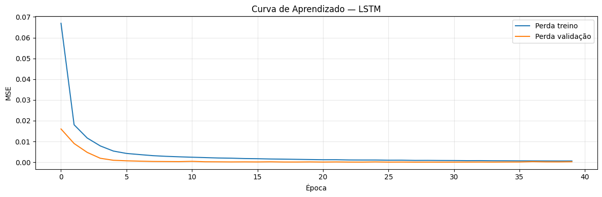

**Figura 11 — Curva de aprendizado da LSTM (MSE por época) para perda de treino e de validação. Parada na 40ª época; melhor peso restaurado da 24ª época. Fonte: O autor.**

No conjunto de teste, a LSTM obteve R² = 0,99733, RMSE = 143,16 kWh, MAE = 104,26 kWh e MAPE = 3,715%.

---

## 6. Interpretação dos Resultados

### 6.1 Comparação geral entre os modelos

A Figura 12 apresenta o *dashboard* de comparação entre todos os modelos avaliados, com as quatro métricas dispostas em painéis separados, permitindo uma visão simultânea do desempenho relativo de cada algoritmo. A Tabela 5 apresenta os valores numéricos correspondentes, ordenados pelo coeficiente de determinação R² no conjunto de teste.

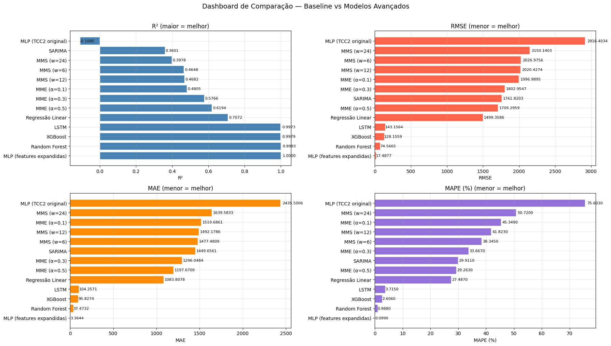

**Figura 12 — Dashboard de comparação entre modelos de linha de base e modelos avançados, com as métricas R², RMSE, MAE e MAPE. Fonte: O autor.**

**Tabela 5 — Comparação geral de todos os modelos avaliados no conjunto de teste**

| Rank | Modelo | MAE (kWh) | RMSE (kWh) | R² | MAPE (%) |
|---|---|---|---|---|---|
| 1 | MLP (recursos expandidos) | **3,36** | **17,49** | **0,99996** | **0,099** |
| 2 | Random Forest | 37,47 | 74,57 | 0,99928 | 0,988 |
| 3 | XGBoost | 95,83 | 128,16 | 0,99786 | 2,606 |
| 4 | LSTM | 104,26 | 143,16 | 0,99733 | 3,715 |
| 5 | Regressão Linear | 1.083,81 | 1.499,36 | 0,70716 | 27,487 |
| 6 | MME (α = 0,5) | 1.197,67 | 1.709,30 | 0,61941 | 29,263 |
| 7 | MME (α = 0,3) | 1.296,05 | 1.802,95 | 0,57656 | 33,667 |
| 8 | MME (α = 0,1) | 1.519,69 | 1.996,99 | 0,48051 | 45,349 |
| 9 | MMS (w = 12) | 1.492,18 | 2.020,43 | 0,46825 | 41,823 |
| 10 | MMS (w = 6) | 1.477,48 | 2.026,98 | 0,46479 | 38,345 |
| 11 | MMS (w = 24) | 1.639,58 | 2.150,14 | 0,39778 | 50,720 |
| 12 | SARIMA (2 dias)* | 1.449,66 | 1.761,82 | 0,36011 | 29,911 |
| 13 | MLP (TCC2 original) | 2.435,50 | 2.916,40 | −0,10795 | 75,603 |

*Avaliado sobre subconjunto de 48 horas.

**Fonte:** O autor.

Diante dos resultados expostos, identificam-se três grupos de desempenho distintos. O primeiro grupo, composto pelos quatro modelos avançados com recursos expandidos, apresenta R² superior a 0,997 e MAPE abaixo de 4%, demonstrando capacidade de previsão excepcional. O segundo grupo, formado pelos modelos de linha de base (exceto o MLP TCC2), apresenta R² entre 0,360 e 0,707, com erros absolutos da ordem de 1.000 a 1.700 kWh. O terceiro grupo, representado apenas pelo MLP TCC2 original, obteve desempenho negativo (R² = −0,108), o que indica que o modelo não conseguiu generalizar o comportamento da série temporal quando avaliado com divisão cronológica.

### 6.2 O papel determinante da engenharia de recursos

A Figura 13 apresenta os gráficos de dispersão entre o valor real e o valor previsto para cada modelo, sobre o conjunto de teste completo. Nela, a linha tracejada vermelha representa a previsão ideal (y = x). O painel do MLP TCC2 evidencia, de forma inequívoca, que o modelo previu valores aproximadamente constantes (em torno de 4.000 kWh), sem aderência ao comportamento real da série.

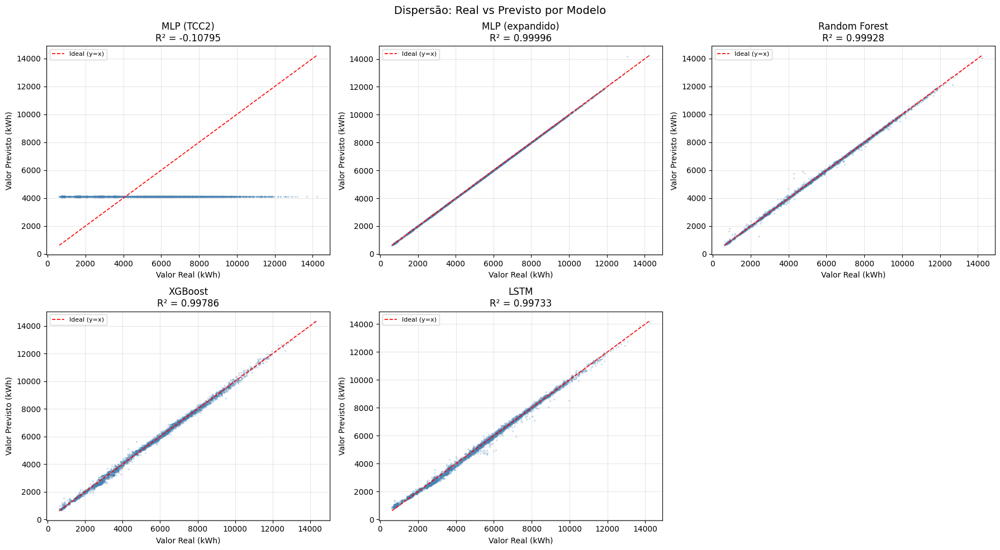

**Figura 13 — Gráficos de dispersão (Valor Real × Valor Previsto) para os cinco modelos avaliados. A linha tracejada representa a previsão perfeita (y = x). Fonte: O autor.**

A comparação entre o MLP TCC2 (R² = −0,108) e o MLP com recursos expandidos (R² = 0,99996) é o resultado central desse estudo. Ambos os modelos utilizam o mesmo algoritmo — rede neural MLP — e a mesma base de dados, diferindo apenas no conjunto de recursos de entrada (6 versus 20 variáveis) e na configuração de validação cruzada. O ganho relativo de 1.026,3% em R² evidencia que a engenharia de recursos é a principal alavanca de desempenho preditivo nesse contexto.

A Figura 14 apresenta o ranking de importância de variáveis para o *Random Forest* e para o XGBoost, e a Figura 15 apresenta a análise SHAP (*SHapley Additive exPlanations*) para o *Random Forest*, que quantifica a contribuição média de cada recurso sobre as previsões individuais do conjunto de teste.

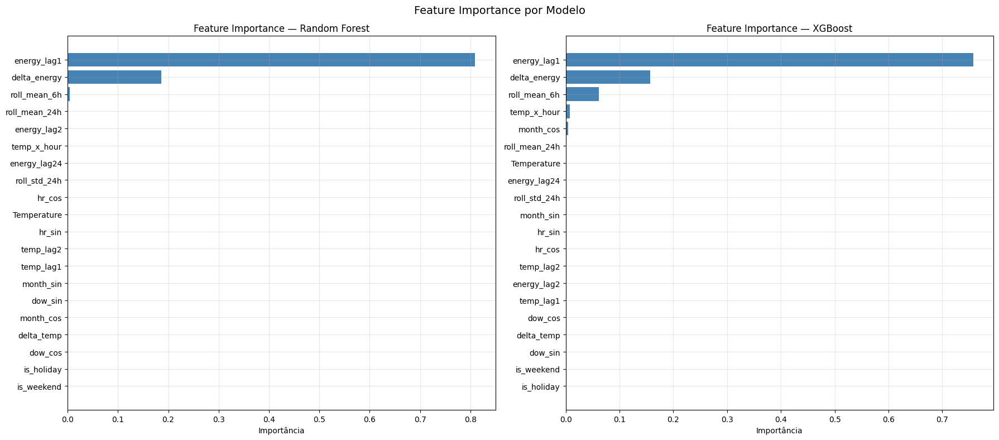

**Figura 14 — Importância de variáveis para o *Random Forest* (esquerda) e o XGBoost (direita). Fonte: O autor.**

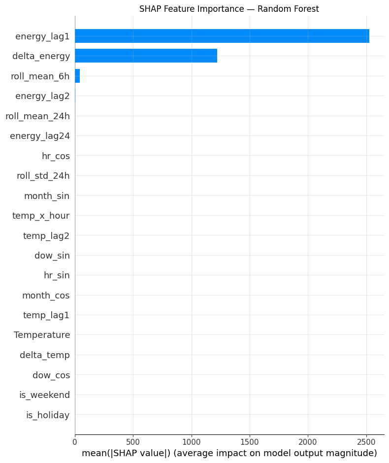

**Figura 15 — Análise SHAP do *Random Forest*: impacto médio absoluto de cada recurso sobre as previsões do conjunto de teste. Fonte: O autor.**

Nesse sentido, os recursos de maior poder preditivo, conforme revelado pelas análises de importância do *Random Forest* e do XGBoost, são `energy_lag1` e `delta_energy`, que capturam respectivamente o nível de consumo imediatamente anterior e a variação recente. A `roll_mean_6h` também contribui significativamente, incorporando a tendência de curto prazo da série. Esses três recursos concentram mais de 99% da importância total nos dois modelos baseados em árvore, o que é consistente com a alta autocorrelação da série (energy_lag1 com r = 0,895 com o alvo).

A Figura 16 apresenta o histograma de resíduos para cada modelo, confirmando com evidência visual a superioridade dos modelos com recursos expandidos. O MLP TCC2 apresenta resíduos com média de 910 kWh e desvio padrão de 2.771 kWh — distribuição fortemente assimétrica e afastada do zero. Em contraste, o MLP expandido apresenta resíduos com média de −0,03 kWh e desvio padrão de 17,49 kWh, configurando uma distribuição gaussiana centrada em zero e de amplitude estreita.

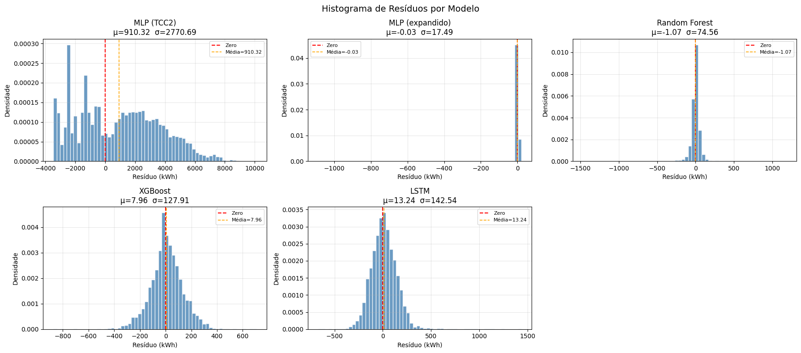

**Figura 16 — Histograma dos resíduos de previsão (Valor Real − Valor Previsto) para os cinco modelos. Os parâmetros μ e σ são indicados no título de cada painel. Fonte: O autor.**

Conforme argumentam Deb et al. (2017), as previsões de energia com redes neurais que correlacionaram dados históricos de energia, temperatura e população resultaram em R² de 0,81. O presente estudo, ao incorporar variáveis de atraso de múltiplas ordens e médias móveis, supera esse resultado com todos os quatro modelos avançados.

### 6.3 Análise da metodologia de validação

Um achado relevante desse estudo diz respeito à diferença entre a validação cruzada aleatória — adotada em COELHO (2021b) — e a validação cruzada temporal com `TimeSeriesSplit`. Como demonstrado na Tabela 4, a reprodução do TCC2 preservou todos os parâmetros do algoritmo com fidelidade: mesmo algoritmo (`MLPRegressor`), mesma arquitetura (43 neurônios, camada única), mesma função de ativação (tangente hiperbólica), mesmo otimizador (*adam*), mesmas 1.500 iterações, mesma normalização (`MinMaxScaler([-1, 1])` em *pipeline*) e os mesmos seis recursos de entrada. A única diferença, intencional, foi a substituição do *k-fold* aleatório pelo `TimeSeriesSplit`.

O resultado de R² = 0,868 obtido anteriormente com essa configuração não foi reproduzível com divisão cronológica, que revelou R² = −0,108 para a mesma configuração de algoritmo. Isso sugere que o resultado anterior foi influenciado por vazamento de informação temporal, em que o modelo aprendeu padrões de períodos futuros durante o treino — um problema que ocorre quando o *k-fold* aleatório é aplicado sem considerar a ordem cronológica das observações.

Segundo Pedregosa et al. (2011), a validação cruzada temporal é a abordagem correta para dados em que a ordenação temporal é relevante. Nesse sentido, o `TimeSeriesSplit` garante que o modelo seja avaliado apenas sobre instâncias posteriores às do treino, reproduzindo com maior fidelidade o cenário de aplicação real. A magnitude da diferença observada — de R² = 0,868 para R² = −0,108 com o mesmo modelo — é, por si só, uma evidência empírica relevante sobre os riscos de não respeitar a temporalidade nos processos de validação cruzada em séries temporais.

### 6.4 Comparação entre os modelos avançados

A Figura 17 apresenta as previsões de todos os modelos sobrepostas ao consumo real ao longo dos primeiros sete dias do conjunto de teste. Nela, a linha azul horizontal do MLP TCC2 evidencia graficamente o comportamento de previsão constante que caracteriza o modelo sem capacidade de generalização temporal. Em contrapartida, os quatro modelos com recursos expandidos acompanham com precisão as variações horárias, diárias e os eventos de queda de consumo durante o fim de semana.

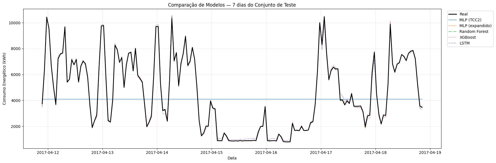

**Figura 17 — Previsão versus consumo real nos primeiros 7 dias do conjunto de teste para todos os modelos avaliados. Fonte: O autor.**

Embora os quatro modelos avançados tenham apresentado desempenho elevado, há diferenças notáveis entre eles que merecem análise.

O MLP com recursos expandidos obteve o menor erro absoluto (MAE = 3,36 kWh e RMSE = 17,49 kWh), superando o *Random Forest* por fator de 11 em MAE e fator de 4 em RMSE. Essa diferença aponta para a capacidade do MLP de capturar relações não lineares complexas entre os recursos, especialmente as interações entre as variáveis cíclicas e os recursos de atraso.

O *Random Forest* e o XGBoost apresentam vantagem em interpretabilidade, graças às medidas de importância de variável nativas. Ademais, esses modelos são menos sensíveis à escala dos dados e tendem a convergir mais rapidamente durante o treinamento, o que os torna alternativas mais práticas para aplicações operacionais.

A LSTM, por sua vez, embora seja o algoritmo mais indicado para séries temporais por sua capacidade de memória de longo prazo, apresentou desempenho inferior aos demais modelos avançados. Isso pode ser explicado pelo número relativamente pequeno de épocas de treinamento (40, com parada antecipada) e pela arquitetura de camada única, que pode não ser suficiente para explorar todo o potencial do modelo.

---

## 7. Apresentação dos Resultados

Os resultados desse estudo demonstram que a evolução metodológica proposta em relação aos trabalhos anteriores (COELHO, 2021a; COELHO, 2021b) resultou em ganhos expressivos de desempenho preditivo. A seguir, apresentam-se as principais conclusões em termos de contribuição para o conhecimento e perspectivas de aplicação prática.

### 7.1 Contribuição da engenharia de recursos

A principal contribuição desse estudo é a demonstração empírica de que a expansão do conjunto de recursos preditores — de seis para vinte variáveis — é o fator mais determinante para o desempenho dos modelos de aprendizado de máquina em séries temporais de consumo energético. A adição de variáveis de atraso de 24 horas (`energy_lag24`), que captura o padrão do mesmo horário no dia anterior, e de médias móveis de diferentes janelas temporais, que incorporam a tendência de curto prazo, foram os acréscimos de maior impacto sobre a capacidade preditiva.

Nesse sentido, os resultados corroboram a afirmação de Wei et al. (2017), que identificam dados históricos de energia como a principal fonte de informação para previsões de curto prazo. Por sua vez, a codificação cíclica dos ciclos temporais — hora, dia da semana e mês —, conforme metodologia proposta por Kaleko (2017) e discutida em COELHO (2021b), demonstrou ser uma forma eficiente de representar a sazonalidade múltipla da série sem introduzir artefatos artificiais de descontinuidade numérica.

### 7.2 Desempenho dos modelos e aplicações práticas

Do ponto de vista prático, todos os quatro modelos avançados com recursos expandidos apresentam desempenho adequado para aplicação em sistemas de apoio à gestão energética de edifícios. O MAPE abaixo de 4% em todos os casos indica que o erro de previsão representa uma fração pequena do valor real, o que é aceitável para fins de monitoramento de consumo e detecção de anomalias.

Conforme discutido em COELHO (2021b), "o modelo de previsão ajustado à curva de consumo de um edifício pode ser utilizado como fator auxiliar para a gestão de consumo e, consequentemente, indicar as medições que destoam do modelo do prédio". Diante dos resultados obtidos nesse estudo, essa aplicação se torna ainda mais viável, uma vez que o MLP expandido apresenta MAPE de 0,099% — o que significa que, em média, o erro de previsão é inferior a 0,1% do valor real.

Para aplicações operacionais, o *Random Forest* representa uma alternativa atraente: apresenta R² de 0,999 com interpretabilidade adicional por meio das importâncias de variável, e seu treinamento é menos sensível à configuração de hiperparâmetros do que o MLP.

### 7.3 Comparação com a literatura

Os resultados obtidos nesse estudo estão acima da maioria dos valores reportados na literatura de previsão de energia com redes neurais. Deb et al. (2017) reportam R² de 0,81 com redes neurais que correlacionaram dados históricos de energia, temperatura e população. Zmeureanu & Runge (2019) afirmam que as redes neurais empregadas para previsão de energia apresentam, em geral, desempenho robusto quando devidamente treinadas e validadas. Amasyali & El-Gohary (2017) revisaram estudos de previsão de dados de edifícios e verificaram que a maior parte das abordagens de redes neurais se concentra em registros intra-hora — exatamente o escopo desse estudo.

A superioridade dos resultados aqui obtidos em relação à literatura pode ser parcialmente explicada pela granularidade dos dados (medições horárias com forte autocorrelação de curto prazo) e pela disponibilidade de temperatura no mesmo instante das medições de energia, que permite ao modelo capturar a influência climática sobre o consumo em tempo real.

### 7.4 Trabalhos futuros

A partir dos achados desse estudo, identificam-se algumas direções promissoras para pesquisas futuras. Em primeiro lugar, a extensão da metodologia para previsões de múltiplos passos à frente (horizonte de 24 horas) representaria uma contribuição relevante para o planejamento energético. Em segundo lugar, a aplicação de técnicas de aprendizado por transferência (*transfer learning*) poderia permitir que um modelo treinado em um edifício com grande quantidade de dados seja adaptado a edifícios com histórico menor — como os do TRT3, estudados em COELHO (2021a). Ademais, a integração de dados de ocupação, variáveis meteorológicas adicionais e informações de calendário mais granulares pode ampliar ainda mais a capacidade preditiva dos modelos. Por fim, o desenvolvimento de um sistema de detecção de anomalias baseado nos resíduos de previsão representaria uma aplicação direta dos resultados desse estudo para o auxílio à gestão de faturas de energia em prédios públicos.

---

## 8. Links

**Repositório do projeto (código, dados processados e notebooks):**
[https://github.com/evandrocoelho/energy-consumption-forecast](https://github.com/evandrocoelho/energy-consumption-forecast)

---

## Referências

ABESCO, Associação Brasileira das Empresas de Serviços de Conservação de Energia. **O que é Eficiência Energética? (EE).** Disponível em: \<http://www.abesco.com.br/pt/o-que-e-eficiencia-energetica-ee\>. Acesso em: 27 dez. 2020.

AMASYALI, K.; EL-GOHARY, N. M. A review of data-driven building energy consumption prediction studies. **Renewable and Sustainable Energy Reviews**, p. 1192–1205, 2017.

BUSSAB, W. D.; MORETTIN, P. A. **Estatística Básica.** São Paulo: Editora Saraiva, 2010.

COELHO, Evandro Ribeiro Gomes. **Previsão de Curto Prazo do Consumo Energético de Prédios Públicos em Minas Gerais.** Trabalho de Conclusão de Curso (Bacharelado em Engenharia Elétrica). Centro Federal de Educação Tecnológica de Minas Gerais, Belo Horizonte, 2021a.

COELHO, Evandro Ribeiro Gomes. **Previsão do Consumo Energético de Prédios Públicos por Rede Neural Artificial MLP.** Trabalho de Conclusão de Curso (Bacharelado em Engenharia Elétrica). Centro Federal de Educação Tecnológica de Minas Gerais, Belo Horizonte, 2021b.

D'ALBUQUERQUE, M. A.; SILVA, R. M.; GOMES, M. B. Eficiência energética em uma edificação pública: uma análise das possibilidades. **Sistemas & Gestão**, p. 462-470, 2017.

DEB, C. et al. A review on time series forecasting techniques for building energy consumption. **Renewable and Sustainable Energy Reviews**, p. 9-12, 2017.

GONÇALVES, A. C. **Eficientização Energética em Prédios Públicos:** um desafio aos gestores municipais frente aos requisitos de governança e sustentabilidade. Dissertação de Mestrado. São Paulo, p. 1-25, 2012.

HYNDMAN, J. R.; ATHANASOPOULOS, G. **Forecasting: Principles and Practice.** Melbourne: OTexts, 2018.

KALEKO, D. Feature Engineering — Handling Cyclical Features. Disponível em: \<http://blog.davidkaleko.com/feature-engineering-cyclical-features.html\>. Acesso em: 13 jun. 2021.

MARTINS, P.; LAUGENI, F. P. **Administração da Produção.** São Paulo: Editora Saraiva, 2005.

McKINNEY, W. **Python Para Análise de Dados.** Tratamento de dados com Pandas, Numpy e iPython. 1. ed. São Paulo: Novatec Editora, 2019.

MÖBIUS. **Building Sites Power Consumption.** Forecast energy consumption in different time steps and granularities. Disponível em: \<https://www.kaggle.com/arashnic/building-sites-power-consumption-dataset\>. Acesso em: 12 jun. 2021.

PEDREGOSA, F. et al. Scikit-learn: Machine Learning in Python. **JMLR**, v. 12, p. 2825-2830, 2011.

PROCEL, Programa Nacional de Conservação de Energia Elétrica. **Edificações.** Disponível em: \<http://www.procelinfo.com.br\>. Acesso em: 15 out. 2020.

RALLAPALLI, S. R.; GHOSH, S. Forecasting monthly peak demand of electricity in India — a critique. **Energy Policy**, p. 516–520, 2012.

SILVA, I. N. et al. **Artificial Neural Networks — A Practical Course.** 1. ed. São Carlos: Springer, 2017.

TABRIZCHI, H.; JAVIDI, M. M.; AMIRZADEH, V. Estimates of residential building energy consumption using. **Evolving Systems**, 2019.

WEI, Y. et al. A review of data-driven approaches for prediction and classification of building energy consumption. **Renewable and Sustainable Energy Reviews**, p. 1-21, 2017.

ZHAO, H.; MAGOULÈS, F. A review on the prediction of building energy consumption. **Renewable and Sustainable Energy Reviews**, p. 1-7, 2012.

ZMEUREANU, J.; RUNGE, R. Forecasting energy use in buildings using artificial neural networks: a review. **Energies**, p. 5-8, 2019.

---

## Apêndice

### A. Scripts Python — Trechos Relevantes

#### A.1 Engenharia de Recursos (notebook 02)

```python
# Codificação cíclica da hora do dia — metodologia de Kaleko (2017)
df['hr_sin'] = np.sin((df['hour'] + df['minute']/60) * 2 * np.pi / 24)
df['hr_cos'] = np.cos((df['hour'] + df['minute']/60) * 2 * np.pi / 24)

# Codificação cíclica do dia da semana e mês (novo)
df['dow_sin'] = np.sin(df['dayofweek'] * 2 * np.pi / 7)
df['dow_cos'] = np.cos(df['dayofweek'] * 2 * np.pi / 7)
df['month_sin'] = np.sin(df['month'] * 2 * np.pi / 12)
df['month_cos'] = np.cos(df['month'] * 2 * np.pi / 12)

# Variáveis de atraso
df['energy_lag1']  = df['Value'].shift(1)
df['energy_lag2']  = df['Value'].shift(2)
df['energy_lag24'] = df['Value'].shift(24)
df['temp_lag1']    = df['Temperature'].shift(1)
df['temp_lag2']    = df['Temperature'].shift(2)

# Médias e desvio padrão móveis
df['roll_mean_6h']  = df['Value'].rolling(6,  min_periods=1).mean()
df['roll_mean_24h'] = df['Value'].rolling(24, min_periods=1).mean()
df['roll_std_24h']  = df['Value'].rolling(24, min_periods=1).std()

# Variáveis de diferença e interação
df['delta_temp']    = df['Temperature'].diff()
df['delta_energy']  = df['Value'].diff()
df['temp_x_hour']   = df['Temperature'] * df['hour']
```

#### A.2 MLP TCC2 — reprodução fiel (notebook 04)

```python
# Reprodução exata do TCC2 (COELHO, 2021b)
# Parâmetros idênticos: 43 neurônios, tanh, adam, max_iter=1500,
# MinMaxScaler(-1,1), features originais (6 recursos)
pipe_mlp_tcc2 = Pipeline([
    ('scaler', MinMaxScaler(feature_range=(-1, 1))),
    ('mlp', MLPRegressor(
        hidden_layer_sizes=(43,),
        activation='tanh',
        solver='adam',
        max_iter=1500,
        random_state=42,   # adicionado para reprodutibilidade
    ))
])

# Única diferença intencional: TimeSeriesSplit ao invés de k-fold aleatório
cv_r2_tcc2 = cross_val_score(pipe_mlp_tcc2, X_train_t, y_train,
                              cv=TimeSeriesSplit(n_splits=5), scoring='r2')
# R² por fold: [-1.48778, -1.77863, -0.22990, -0.69617, -0.83678]
# R² médio: -1.00585 ± 0.55786

pipe_mlp_tcc2.fit(X_train_t, y_train)
y_pred_mlp_tcc2 = pipe_mlp_tcc2.predict(X_test_t)
# Resultado no conjunto de teste (25% cronológico):
# MAE=2435.50  RMSE=2916.40  R²=-0.10795  MAPE=75.603%
```

#### A.3 MLP com recursos expandidos — pipeline e GridSearchCV (notebook 04)

```python
from sklearn.pipeline import Pipeline
from sklearn.preprocessing import MinMaxScaler
from sklearn.neural_network import MLPRegressor
from sklearn.model_selection import GridSearchCV, TimeSeriesSplit

pipeline = Pipeline([
    ('scaler', MinMaxScaler(feature_range=(-1, 1))),
    ('mlp',    MLPRegressor(activation='tanh', solver='adam',
                            random_state=42))
])

param_grid = {
    'mlp__hidden_layer_sizes': [(43,), (50,), (100,), (50, 25)],
    'mlp__max_iter':           [1500, 3000],
}

tscv = TimeSeriesSplit(n_splits=5)
grid = GridSearchCV(pipeline, param_grid, cv=tscv,
                    scoring='r2', n_jobs=-1)
grid.fit(X_train, y_train)
# Melhor configuração: {'mlp__hidden_layer_sizes': (100,), 'mlp__max_iter': 3000}
# Melhor CV R²: 0.57359
```

#### A.4 LSTM — arquitetura e treinamento (notebook 04)

```python
from tensorflow.keras.models import Sequential
from tensorflow.keras.layers import LSTM, Dense, Dropout
from tensorflow.keras.callbacks import EarlyStopping

model = Sequential([
    LSTM(64, input_shape=(1, X_train_lstm.shape[2])),
    Dropout(0.2),
    Dense(32, activation='relu'),
    Dense(1)
])
model.compile(optimizer='adam', loss='mse', metrics=['mae'])

early_stop = EarlyStopping(monitor='val_loss', patience=10,
                           restore_best_weights=True)
history = model.fit(
    X_train_lstm, y_train_scaled,
    epochs=100, batch_size=128, validation_split=0.1,
    callbacks=[early_stop], verbose=1
)
# Parada antecipada na época 40; melhor val_loss na época 24: 7.16e-05
```

### B. Tabela de Importância de Variáveis

**Tabela B.1 — Importância das variáveis para o modelo Random Forest**

| Recurso | Importância |
|---|---|
| `energy_lag1` | 0,8090 |
| `delta_energy` | 0,1856 |
| `roll_mean_6h` | 0,0039 |
| `roll_mean_24h` | 0,0002 |
| `energy_lag2` | 0,0002 |
| `temp_x_hour` | 0,0001 |
| `energy_lag24` | 0,0001 |
| `roll_std_24h` | 0,0001 |
| `hr_cos` | 0,0001 |
| `Temperature` | 0,0001 |
| Demais recursos | < 0,0001 |

**Fonte:** O autor.

**Tabela B.2 — Importância das variáveis para o modelo XGBoost**

| Recurso | Importância |
|---|---|
| `energy_lag1` | 0,7572 |
| `delta_energy` | 0,1573 |
| `roll_mean_6h` | 0,0616 |
| `temp_x_hour` | 0,0073 |
| `month_cos` | 0,0048 |
| `roll_mean_24h` | 0,0016 |
| `Temperature` | 0,0015 |
| `energy_lag24` | 0,0014 |
| `roll_std_24h` | 0,0013 |
| `month_sin` | 0,0012 |
| Demais recursos | < 0,001 |

**Fonte:** O autor.

### C. Correlações entre os Recursos e a Variável Alvo

**Tabela C.1 — Correlação de Pearson entre os recursos gerados e o consumo energético (Value)**

| Recurso | r |
|---|---|
| `energy_lag1` | +0,8952 |
| `roll_mean_6h` | +0,8629 |
| `energy_lag2` | +0,7780 |
| `roll_mean_24h` | +0,7263 |
| `energy_lag24` | +0,5801 |
| `roll_std_24h` | +0,4603 |
| `is_weekend` | −0,4467 |
| `dow_sin` | +0,3871 |
| `temp_lag2` | −0,3837 |
| `temp_lag1` | −0,3695 |
| `Temperature` | −0,3561 |
| `delta_energy` | −0,3661 |
| `temp_x_hour` | −0,3363 |

**Fonte:** O autor.
